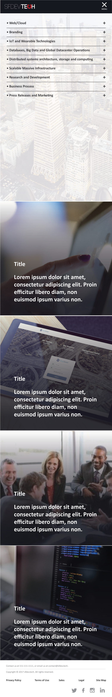

# SFDEV.TECH

Build with HTML/CSS/JS first and then rebuild it using a Framework.

I think the sections should lead to a seperate service page.

For example:

Service: Human-Computer Interaction Design

- Application Demo

    Will lead directly with the white paper portfolio page.

Service: Graphical User Interface Design

Service: Full-Stack Web Development

